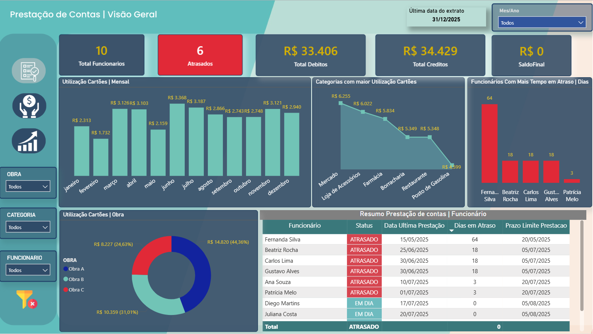
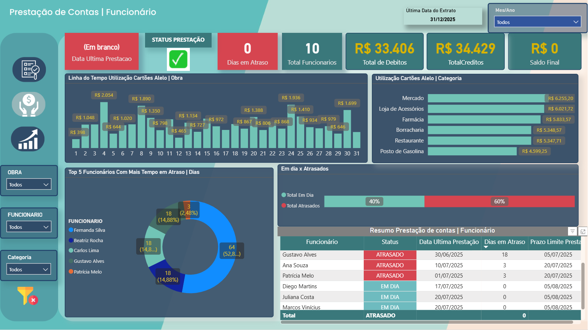
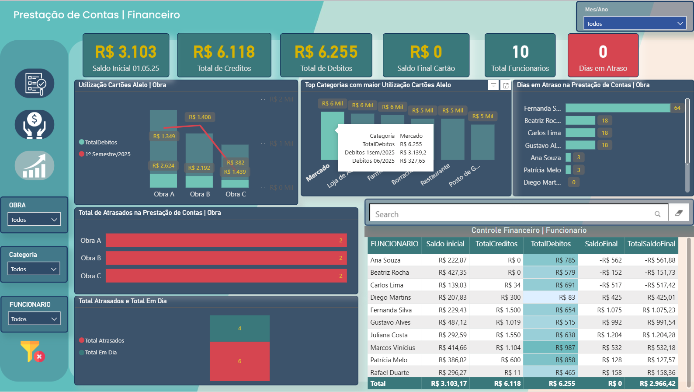

# 📊 Dashboard Prestação de Contas Atrasos e Alertas
Este relatório foi desenvolvido para acompanhar a prestação de contas dos cartões Alelo dos funcionários da empresa.

A estrutura do relatório atende a uma demanda real da empresa, permitindo análises estratégicas por obra, veículo e funcionário — além de identificar padrões de consumo, variações de custo e possíveis comportamentos irregulares.

---
## 🛠️ Tecnologias utilizadas

---

## ⚙️ Estrutura da solução

1. Importação das planilhas Excel que contêm os extratos financeiros individuais.
2. Consolidação e união dessas planilhas via Power Query no Power BI.
3. Tratamento e limpeza dos dados, removendo inconsistências.
4. Criação de colunas calculadas e medidas de alerta para análise de saldos, status de prestação e dias em atraso.
5. Atualização quinzenal dos dados com novas planilhas.
6. Construção de dashboards interativos para acompanhamento e gestão financeira.

---

## 🖼️ Imagem dos dashboards

---
🚀 **Click abaixo e veja meu Dashboard publicado**:  

